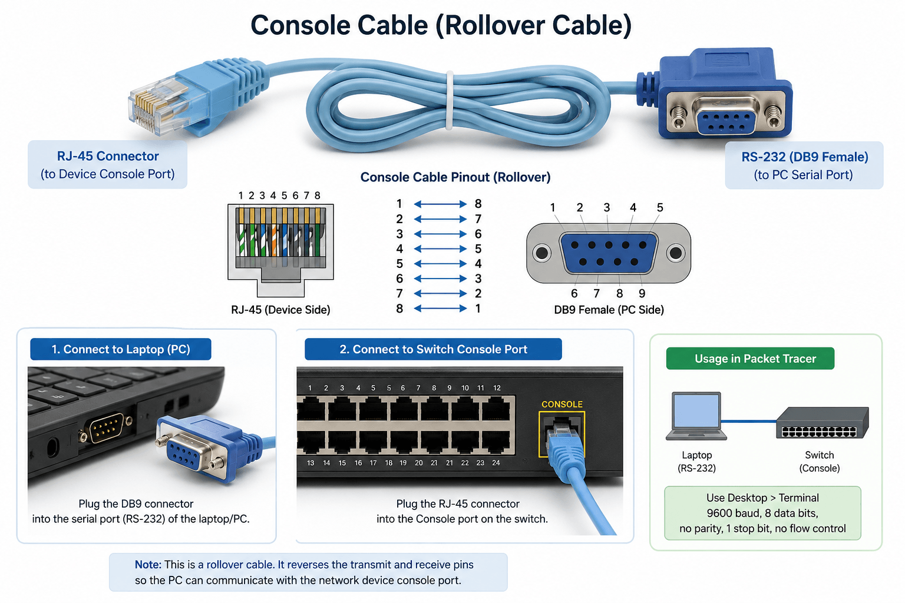

# Packet Tracer 8.2.2 - Lab 1 : Basic Switch Setup

Copyright : http://www.packettracernetwork.com

> **แนวคิดของเอกสารนี้**
>
> เรียนรู้ **พื้นฐานและคำสั่งของ Cisco IOS ก่อน** จากนั้นจึงลงมือทำ Lab
> และดูเฉลยท้ายบท

------------------------------------------------------------------------

# สารบัญ

1.  พื้นฐาน Cisco IOS
2.  รู้จักคำสั่งที่ใช้ใน Lab
3.  วิเคราะห์โจทย์
4.  ลงมือทำ Lab
5.  เฉลยพร้อมคำอธิบาย
6.  สรุป

------------------------------------------------------------------------

# 1. พื้นฐาน Cisco IOS

## User EXEC Mode

```bash
    Switch>
```

เป็นโหมดเริ่มต้น ใช้ตรวจสอบสถานะอุปกรณ์

เข้าสู่โหมดผู้ดูแล

```bash
enable
```

------------------------------------------------------------------------

## Privileged EXEC Mode

```bash
    Switch#
```

สามารถดู Configuration และเข้าสู่โหมด Configuration ได้

```bash
configure terminal
```

------------------------------------------------------------------------

## Global Configuration Mode

```bash
    Switch(config)#
```

ใช้กำหนดค่าทั้งระบบ เช่น
-   Hostname
-   Password
-   Banner
-   Interface
-   VLAN
-   Routing

------------------------------------------------------------------------

# 2. รู้จักคำสั่งที่ใช้ใน Lab

| คำสั่ง | หน้าที่ |
|--------|----------|
| `enable` | เข้าสู่โหมด **Privileged EXEC Mode** เพื่อใช้งานคำสั่งระดับผู้ดูแล |
| `configure terminal` | เข้าสู่ **Global Configuration Mode** สำหรับตั้งค่าระบบ |
| `hostname` | กำหนดหรือเปลี่ยนชื่ออุปกรณ์ Cisco |
| `banner motd` | ตั้งข้อความแจ้งเตือน (Message of the Day) ก่อนเข้าสู่ระบบ |
| `enable secret` | ตั้งรหัสผ่านสำหรับโหมด Privileged พร้อมเข้ารหัสแบบ **MD5** |
| `service password-encryption` | เข้ารหัสรหัสผ่านทั้งหมดที่เก็บอยู่ใน Configuration |
| `line console 0` | เข้าโหมดตั้งค่าการเชื่อมต่อผ่าน Console |
| `line vty 0 15` | เข้าโหมดตั้งค่าการเชื่อมต่อผ่าน Telnet/SSH |
| `login` | บังคับให้ผู้ใช้ Login ก่อนเข้าใช้งาน |
| `password` | กำหนดรหัสผ่านให้กับ Console หรือ VTY |
| `history size` | กำหนดจำนวนคำสั่งที่เก็บไว้ในประวัติ (Command History) |
| `exec-timeout` | กำหนดเวลาที่ Session จะ Logout อัตโนมัติเมื่อไม่มีการใช้งาน |
| `logging synchronous` | ป้องกันข้อความ Log แทรกระหว่างพิมพ์คำสั่ง ทำให้ CLI อ่านง่าย |
| `interface vlan 1` | เข้าโหมดตั้งค่า **Management Interface (SVI)** ของ Switch |
| `ip address` | กำหนดหมายเลข IP Address และ Subnet Mask |
| `no shutdown` | เปิดใช้งาน Interface ที่ถูกปิดอยู่ |
| `ip default-gateway` | กำหนด Default Gateway สำหรับการบริหารจัดการ Switch |
| `copy running-config startup-config` | บันทึก Configuration จาก RAM ลง NVRAM เพื่อให้คงอยู่หลังรีบูต |

------------------------------------------------------------------------

# 3. วิเคราะห์โจทย์

Lab นี้ต้องทำดังนี้
-   ตั้ง Hostname
-   ตั้ง Banner
-   ตั้ง Enable Secret
-   เปิด Password Encryption
-   ตั้ง Console
-   ตั้ง Telnet
-   ตั้ง IP Management
-   ตั้ง Default Gateway
-   ทดสอบ Telnet

------------------------------------------------------------------------

# 4. ลงมือทำ Lab

## 4.1 เชื่อมต่อ Console



-   ใช้สาย Console (สีฟ้า)
-   Laptop → Desktop → Terminal
-   กด OK

------------------------------------------------------------------------

## 4.2 เปลี่ยนชื่อ Switch

``` cisco
enable
configure terminal
hostname LOCAL-SWITCH
```

------------------------------------------------------------------------

## 4.3 Banner

``` cisco
banner motd #
Unauthorized access is forbidden#
```

------------------------------------------------------------------------

## 4.4 Enable Secret

``` cisco
enable secret cisco
```

------------------------------------------------------------------------

## 4.5 Password Encryption

``` cisco
service password-encryption
```

------------------------------------------------------------------------

## 4.6 Console

``` cisco
line console 0
password ciscoconsole
login
history size 15
exec-timeout 6 45
logging synchronous
```

------------------------------------------------------------------------

## 4.7 Telnet

``` cisco
line vty 0 15
password ciscotelnet
login
history size 15
exec-timeout 8 20
logging synchronous
```

------------------------------------------------------------------------

## 4.8 Management IP

``` cisco
interface vlan 1
ip address 192.168.1.2 255.255.255.0
no shutdown

ip default-gateway 192.168.1.1
```

------------------------------------------------------------------------

## 4.9 ทดสอบ

Remote Laptop

``` text
telnet 192.168.1.2
```

------------------------------------------------------------------------

# 5. เฉลย

``` cisco
enable
configure terminal
hostname LOCAL-SWITCH

banner motd #
Unauthorized access is forbidden#

enable secret cisco
service password-encryption

line console 0
 password ciscoconsole
 login
 history size 15
 exec-timeout 6 45
 logging synchronous
 exit

line vty 0 15
 password ciscotelnet
 login
 history size 15
 exec-timeout 8 20
 logging synchronous
 exit

interface vlan 1
 ip address 192.168.1.2 255.255.255.0
 no shutdown
 exit

ip default-gateway 192.168.1.1

copy running-config startup-config
```

------------------------------------------------------------------------

# 6. สรุป

เมื่อจบบทนี้ คุณจะสามารถ
-   เข้าใจ Cisco IOS Mode
-   ตั้งค่า Hostname
-   ตั้ง Banner
-   ตั้ง Enable Secret
-   ตั้ง Console
-   ตั้ง Telnet
-   ตั้ง Management IP
-   บันทึก Configuration
-   ทดสอบ Telnet ได้
