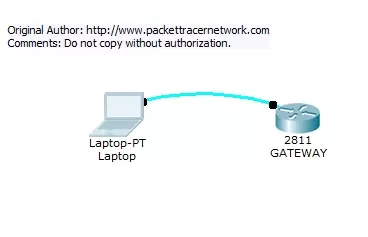

# Packet Tracer 8.2.2 - Lab 11 HDLC configuration

## Introduction

HDLC is a data link protocol used on synchronous serial data links. Because the standardized HDLC cannot support multiple protocols on a single link (lack of a mechanism to indicate which protocol is carried), Cisco developped a proprietary version of HDLC, called cHDLC, with a proprietary field acting as a protocol field. This field makes it possible for a single serial link to accommodate multiple network-layer protocols.

Cisco’s HDLC is a point-to-point protocol that can only be used on serial links or leased lines between two Cisco devices. PPP has to be used when communicating with non-Cisco devices. HDLC is the default encapsulation on serial links in a Cisco router. However, to change the encapsulation back to HDLC from [PPP](https://www.packettracernetwork.com/labs/lab12-ppp.html), use the following command from interface configuration mode:

```sh
Router(config-if)#encapsulation hdlc
```

With a back-to-back serial connection, the ISR router connected to the **DCE** end of the serial cable provides the clock signal for the serial link. This clock is received by the **DTE** device. The **clock rate** command in the interface configuration mode enables the router at the DCE end of the cable to provide the clock signal for the serial link. The default clock rate is 64000.

## Network diagram



## Lab instructions

This lab will test your ability to configure HDLC back to back connection on a serial link between two Cisco ISR routers in Packet Tracer 8.0 . Practicing this labs will you to get ready for the CCNA certification exam simulation questions.

1. Use the connected laptops to find the DCE and DTE routers. You can connect to the routers using CLI.

2. Configure the routers with the following parameters :

        - Clock : 250000
        - HDLC link between the routers
        - DCE router IP : 192.168.10.5/30

        - DTE router IP : 192.168.10.6/30

3. Check IP connectivity between the two routers using the ping command.

## Solution

### Step 1 — Identify DCE and DTE Routers

In a **back-to-back serial connection**, one side of the cable acts as **DCE** (provides clock signal), and the other as **DTE** (receives it).
We’ll determine which router is which.

Commands (on both routers):

```sh
show controllers serial 0/0/0
```

**Expected Results**:

- DCE router output: will show `DCE V.35`
- DTE router output: will show `DTE V.35`

Example :

```sh
Router-A#show controllers serial 0/0/0
DTE V.35 TX and RX clocks detected

Router-B#show controllers serial 0/0/0
DCE V.35, clock rate 2000000
```

In this case, **Router-B = DCE** and **Router-A = DTE**

<br>

### Step 2 — Configure the Serial Interfaces

On Router-B (DCE side):

```sh
enable
configure terminal
interface serial 0/0/0
 clock rate 250000
 encapsulation hdlc
 ip address 192.168.10.5 255.255.255.252
 no shutdown
exit
```

<br>

On Router-A (DTE side):

```sh
enable
configure terminal
interface serial 0/0/0
 encapsulation hdlc
 ip address 192.168.10.6 255.255.255.252
 no shutdown
exit
```

<br>

After a few seconds, both routers should show:

```sh
%LINK-5-CHANGED: Interface Serial0/0/0, changed state to up
```

<br>

### Step 3 — Verify the Link and HDLC

On both routers, type:

```sh
show interfaces serial 0/0/0
```

<br>

You should see:

```sh
Serial0/0/0 is up, line protocol is up
Encapsulation HDLC, loopback not set, keepalive set (10 sec)
Internet address is 192.168.10.5/30   <-- or .6 on the other side
```

<br>

### Step 4 — Test Connectivity

From Router-A, ping Router-B:

```sh
ping 192.168.10.5
```

<br>

You should get:

```sh
!!!!!  (5/5 successful)
```

If not, double-check:
- Both interfaces are up
- Encapsulation is HDLC on both sides
- Correct IP addresses and subnet mask (/30)
<br>

## Final Configuration Summary

| Router   | Interface   | Role    | IP Address       | Encapsulation | Clock Rate |
| -------- | ----------- | ------- | ---------------- | ------------- | ---------- |
| Router-B | Serial0/0/0 | **DCE** | 192.168.10.5 /30 | HDLC          | 250000     |
| Router-A | Serial0/0/0 | **DTE** | 192.168.10.6 /30 | HDLC          | —          |

<br>

## Verification Commands

| Command                         | Description                          |
| ------------------------------- | ------------------------------------ |
| `show controllers serial 0/0/0` | Check DCE/DTE status                 |
| `show interfaces serial 0/0/0`  | Verify link status and encapsulation |
| `ping <ip>`                     | Test connectivity                    |
| `show ip interface brief`       | Check interface status summary       |

<br>

## Lab Summary (in simple terms):

This lab sets up a point-to-point serial link using HDLC between two routers.
You configure one as DCE with a clock rate and both with IP addresses so they can communicate directly.

---